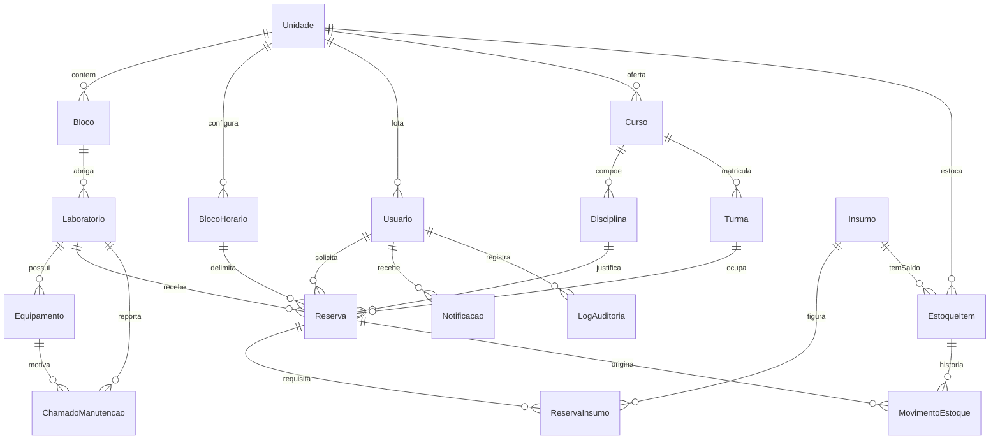
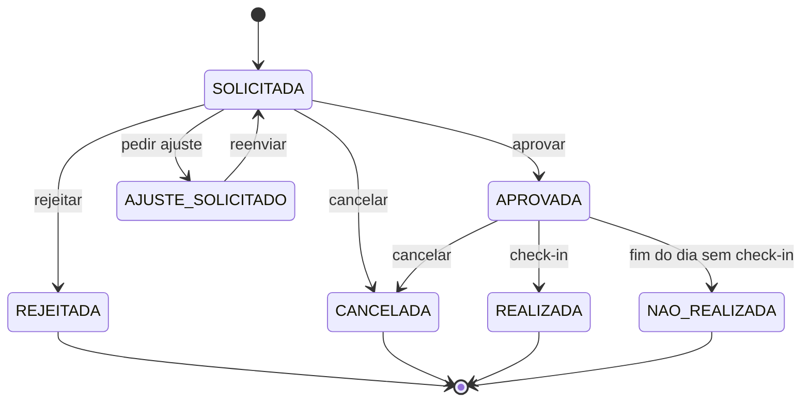

# Modelo de Dados — SIGEL

**Sistema Integrado de Gestão de Laboratórios e Insumos**
Centro Universitário UniBRAS Montes Belos · Curso de Engenharia de Software

| | |
|---|---|
| **Documento** | SIGEL-MOD-2026-01 · v1.0 |
| **Fonte executável** | [`prisma/schema.prisma`](../prisma/schema.prisma) |
| **Deriva de** | [`docs/PRD-SIGEL.md`](PRD-SIGEL.md) (SIGEL-PRD-2026-01 v1.0) |
| **Banco** | PostgreSQL 18 |
| **Conteúdo** | 17 entidades · 11 enumerações · 18 tabelas |

> Este documento **descreve**; o `schema.prisma` **define**. Ao divergirem, o
> arquivo `.prisma` é a verdade — ele é o que gera a migração e o cliente.
> Toda alteração de modelo deve atualizar os dois no mesmo pull request.

---

## 1. Como reproduzir o banco

```bash
cp .env.example .env
npm run db:migrate
npm run db:seed
```

Preencha `DATABASE_URL` e `DIRECT_URL` antes de migrar. As 18 tabelas são as 17
entidades mais `_prisma_migrations`, de controle do próprio Prisma. Nomes de
tabela usam `snake_case` no plural via `@@map`; os modelos usam `PascalCase` no
singular.

## 2. As três decisões que sustentam o modelo

### 2.1 Multi-unidade por coluna — RNF01, RN03

Toda entidade de negócio carrega `unidadeId`. Incluir uma faculdade nova é
inserir um registro, sem alteração de código nem de estrutura.

A coluna existe; o **filtro** é responsabilidade da aplicação. O schema garante
que sempre haja por onde filtrar, não que alguém filtre — por isso a RN03 exige
um teste automatizado de vazamento entre unidades que não pode ser removido.

Duas exceções deliberadas:

| Entidade | Por que não tem `unidadeId` |
|---|---|
| `Insumo` | O catálogo é do grupo. O **saldo** é local, e quem o guarda é `EstoqueItem`. |
| `Usuario` | Tem `unidadeId` **opcional**: nulo para o perfil `MASTER`, cuja visão é a rede inteira. |

### 2.2 Trava anti-conflito por unicidade parcial — RF06, RN04

O requisito é proibir duas reservas no mesmo laboratório, data e faixa de
horário. O caminho óbvio seria:

```prisma
@@unique([laboratorioId, data, blocoHorarioId])
```

Isso quebra o RF08: proibiria também as reservas **canceladas e rejeitadas**, e
o horário nunca voltaria a ficar livre. O que se quer é unicidade *parcial* —
válida só para os estados que ocupam o horário.

A solução é a coluna derivada `Reserva.slotKey`:

- Ao **aprovar**, a aplicação grava `{laboratorioId}:{aaaa-mm-dd}:{blocoHorarioId}`.
- Ao **rejeitar ou cancelar**, grava `NULL`.
- O PostgreSQL não considera dois `NULL` iguais em índice único, então a
  restrição passa a valer apenas onde o slot está ocupado.

A escrita acontece na mesma transação da mudança de status. **A violação da
restrição é o mecanismo de defesa** contra aprovação concorrente: entre duas
aprovações simultâneas, uma sucede e a outra recebe erro de unicidade. Não é um
`if` na aplicação — é o banco.

Alternativa equivalente, se o time preferir SQL explícito em migração:

```sql
CREATE UNIQUE INDEX reserva_slot_ativo
  ON reservas (laboratorio_id, data, bloco_horario_id)
  WHERE status IN ('APROVADA', 'REALIZADA');
```

### 2.3 Estoque com saldo corrente e histórico imutável — RN08

Dois modelos, um par indivisível:

- `EstoqueItem` guarda o **saldo agora** — rápido de ler, é o que a tela mostra.
- `MovimentoEstoque` guarda **como o saldo chegou aqui** — somente inserção.

Saldo nunca muda sem movimento gravado, e sempre na mesma transação. Corrigir
um erro é lançar um movimento de `AJUSTE` com justificativa, nunca reescrever o
passado. É desse histórico que saem os relatórios de consumo e custo (RF18).

Cada movimento guarda também `saldoTotalApos` e `saldoReservadoApos` — uma
fotografia do saldo naquele instante, para reconstruir o extrato sem somar a
tabela inteira.

## 3. Diagrama de entidades



## 4. Enumerações

| Enum | Valores | Onde importa |
|---|---|---|
| `PerfilUsuario` | `MASTER`, `ADMIN_UNIDADE`, `DOCENTE`, `TECNICO` | PRD §5 |
| `AreaConhecimento` | `SAUDE`, `TECNOLOGIA`, `ENGENHARIAS`, `CIENCIAS_EXATAS`, `CIENCIAS_AGRARIAS`, `CIENCIAS_HUMANAS`, `OUTRA` | RF02 |
| `Turno` | `MATUTINO`, `VESPERTINO`, `NOTURNO` | RF03 |
| `StatusReserva` | `SOLICITADA`, `AJUSTE_SOLICITADO`, `APROVADA`, `REJEITADA`, `CANCELADA`, `REALIZADA`, `NAO_REALIZADA` | RF05–RF09 |
| `StatusEquipamento` | `OPERANTE`, `EM_MANUTENCAO`, `INOPERANTE`, `BAIXADO` | RF15 |
| `CategoriaInsumo` | `REAGENTE`, `DESCARTAVEL`, `FERRAMENTA`, `COMPONENTE_ELETRONICO`, `VIDRARIA`, `EPI`, `OUTRO` | RF10 |
| `TipoMovimento` | `ENTRADA`, `RESERVA`, `LIBERACAO_RESERVA`, `BAIXA`, `AJUSTE` | RF12, RF13 |
| `StatusChamado` | `ABERTO`, `EM_ATENDIMENTO`, `RESOLVIDO`, `CANCELADO` | RF16 |
| `PrioridadeChamado` | `BAIXA`, `MEDIA`, `ALTA` | RF16 |
| `TipoNotificacao` | 9 eventos: reserva solicitada, aprovada, rejeitada, ajuste, cancelada, estoque mínimo, chamado aberto, chamado resolvido, laboratório bloqueado | RF07, RF14 |
| `AcaoAuditoria` | 8 ações críticas: reserva cancelada, reserva excluída, estoque ajustado, permissão alterada, estado de equipamento alterado, acesso negado, usuário criado, usuário desativado | RNF04 |

## 5. Entidades

Convenções em todas as tabelas: `id` é `String @id @default(cuid())`;
`criadoEm` é `DateTime @default(now())`; `atualizadoEm` é `DateTime @updatedAt`
onde existe. Esses três campos são omitidos abaixo para não repetir.

### 5.1 Infraestrutura

#### `Unidade` → `unidades`

Campus da rede. Raiz do isolamento de dados.

| Campo | Tipo | Nulo | Nota |
|---|---|:--:|---|
| `codigo` | `String` | — | Único na rede |
| `nome` | `String` | — | |
| `cidade` | `String` | — | |
| `uf` | `Char(2)` | — | |
| `ativa` | `Boolean` | — | Padrão `true`. Unidade em uso é desativada, não excluída |
| `antecedenciaMinimaDias` | `Int` | — | Padrão `3`. **RN01**, configurável por unidade |
| `janelaCheckinMinutos` | `Int` | — | Padrão `30`. Minutos antes do início em que o check-in abre (E5.1 CA1) |

#### `Bloco` → `blocos`

Prédio dentro da unidade. Campos: `unidadeId`, `nome`, `descricao?`.
Único por `[unidadeId, nome]`.

#### `Laboratorio` → `laboratorios`

Espaço agendável.

| Campo | Tipo | Nulo | Nota |
|---|---|:--:|---|
| `unidadeId`, `blocoId` | `String` | — | |
| `codigo` | `String` | — | Único por `[unidadeId, codigo]` |
| `nome` | `String` | — | |
| `area` | `AreaConhecimento` | — | |
| `capacidadeMaxima` | `Int` | — | **RN05** — barra reserva acima da capacidade |
| `regrasDeUso` | `String` | sim | Texto livre |
| `episObrigatorios` | `String[]` | — | Array nativo do Postgres |
| `ativo` | `Boolean` | — | Padrão `true` |
| `bloqueado` | `Boolean` | — | Padrão `false`. **RN06** — ver nota abaixo |
| `motivoBloqueio` | `String` | sim | |

> **Nota de projeto.** `bloqueado` é desnormalizado a partir dos equipamentos
> essenciais inoperantes, para o calendário não precisar agregar a cada leitura.
> Isso troca leitura rápida por dever de consistência: quem altera o estado de
> um equipamento **precisa** recalcular este campo na mesma transação. É a parte
> mais frágil do modelo — merece teste dedicado na Sprint 5.

#### `Equipamento` → `equipamentos`

Item fixo do laboratório. Campos: `laboratorioId`, `nome`, `patrimonio?`,
`status` (`StatusEquipamento`, padrão `OPERANTE`), `essencial` (`Boolean`,
padrão `false`).

`essencial = true` significa que sem este item o laboratório não pode ser
agendado — é o gatilho da **RN06**.

#### `BlocoHorario` → `blocos_horario`

Faixa de horário agendável dentro de um turno. Campos: `unidadeId`, `turno`,
`ordem` (`Int`), `horaInicio` e `horaFim` (`VarChar(5)`, ex. `19:00`), `ativo`.
Único por `[unidadeId, turno, horaInicio]`.

Nenhum horário está fixo no código — **RF03 CA2**.

### 5.2 Pessoas

#### `Usuario` → `usuarios`

| Campo | Tipo | Nulo | Nota |
|---|---|:--:|---|
| `unidadeId` | `String` | **sim** | Nulo apenas para `MASTER` |
| `nome` | `String` | — | |
| `email` | `String` | — | Único globalmente. Normalizado em minúsculas |
| `senhaHash` | `String` | — | bcrypt custo 12. **Nunca** a senha em claro |
| `perfil` | `PerfilUsuario` | — | |
| `ativo` | `Boolean` | — | Padrão `true`. Inativo não autentica |
| `tentativasLogin` | `Int` | — | Padrão `0`. **E1.1 CA2** |
| `bloqueadoAte` | `DateTime` | sim | Preenchido ao atingir 5 tentativas |
| `ultimoAcessoEm` | `DateTime` | sim | |

### 5.3 Contexto acadêmico

Alimentado manualmente no piloto; integração com o sistema acadêmico é v2.

| Entidade | Campos | Unicidade |
|---|---|---|
| `Curso` → `cursos` | `unidadeId`, `nome`, `codigo` | `[unidadeId, codigo]` |
| `Disciplina` → `disciplinas` | `unidadeId`, `cursoId`, `nome`, `codigo`, `periodo?` | `[unidadeId, codigo]` |
| `Turma` → `turmas` | `unidadeId`, `cursoId`, `identificacao`, `semestreLetivo`, `qtdAlunos` | `[unidadeId, cursoId, identificacao, semestreLetivo]` |

### 5.4 Reservas

#### `Reserva` → `reservas`

| Campo | Tipo | Nulo | Nota |
|---|---|:--:|---|
| `unidadeId`, `laboratorioId`, `blocoHorarioId` | `String` | — | O trio laboratório + data + faixa é o **slot** |
| `disciplinaId`, `turmaId`, `solicitanteId` | `String` | — | Contexto da aula e autor |
| `data` | `Date` | — | Sem hora: a hora vem do `BlocoHorario` |
| `qtdAlunosPrevistos` | `Int` | — | Validado contra `capacidadeMaxima` |
| `observacoes` | `String` | sim | |
| `status` | `StatusReserva` | — | Padrão `SOLICITADA` |
| `slotKey` | `String` | **sim** | **Único.** A trava anti-conflito. Ver §2.2 |
| `decisorId`, `decididoEm` | — | sim | Quem decidiu e quando |
| `justificativa` | `String` | sim | **RN07** — obrigatória em rejeição e pedido de ajuste |
| `checkinPorId`, `checkinEm` | — | sim | **RF09** |
| `canceladoEm`, `motivoCancelamento` | — | sim | **RF08** |

Três relações distintas com `Usuario`, nomeadas para o Prisma poder
diferenciá-las: `ReservaSolicitante`, `ReservaDecisor`, `ReservaCheckin`.

#### `ReservaInsumo` → `reserva_insumos`

| Campo | Tipo | Nulo | Nota |
|---|---|:--:|---|
| `reservaId`, `insumoId` | `String` | — | Único por `[reservaId, insumoId]` |
| `qtdSolicitada` | `Decimal(12,3)` | — | O que o docente pediu |
| `qtdReservada` | `Decimal(12,3)` | — | O que foi bloqueado na aprovação |
| `qtdConsumida` | `Decimal(12,3)` | sim | O que foi realmente usado, no check-in |
| `justificativaAjuste` | `String` | sim | Obrigatória quando consumida difere de reservada |
| `precoUnitarioNoConsumo` | `Decimal(12,2)` | sim | Preço congelado no consumo |

> **Por que congelar o preço.** Sem isso, reajustar o catálogo reescreveria
> retroativamente todo o relatório de custo do RF18 — o custo de uma aula de
> março mudaria porque o reagente ficou mais caro em agosto.

`Decimal`, não `Float`: quantidade e dinheiro em ponto flutuante acumulam erro
de arredondamento. Três casas para quantidade (mL, g), duas para preço.

### 5.5 Estoque

#### `Insumo` → `insumos`

Catálogo do grupo. Campos: `codigo` (único), `nome`, `categoria`,
`unidadeMedida`, `precoUnitario` (`Decimal(12,2)`), `ativo`.

#### `EstoqueItem` → `estoque_itens`

Saldo de um insumo em uma unidade. Único por `[insumoId, unidadeId]`.

| Campo | Tipo | Nota |
|---|---|---|
| `saldoTotal` | `Decimal(12,3)` | Quanto existe fisicamente |
| `saldoReservado` | `Decimal(12,3)` | Comprometido com reservas aprovadas |
| `quantidadeMinima` | `Decimal(12,3)` | Gatilho do alerta — **RF14** |
| `localizacao` | `String?` | Prateleira, armário |

**Saldo disponível = `saldoTotal` menos `saldoReservado`.** É o número que a
**RN02** compara na aprovação. Campo calculado, não armazenado.

#### `MovimentoEstoque` → `movimentos_estoque`

Histórico imutável. Campos: `estoqueItemId`, `insumoId`, `unidadeId`,
`usuarioId`, `reservaId?`, `tipo`, `quantidade` (`Decimal(12,3)`),
`justificativa?`, `saldoTotalApos`, `saldoReservadoApos`.

| Tipo | Quando | Efeito |
|---|---|---|
| `ENTRADA` | Compra ou recebimento | `saldoTotal` sobe |
| `RESERVA` | Aprovação da reserva | `saldoReservado` sobe |
| `LIBERACAO_RESERVA` | Cancelamento ou rejeição | `saldoReservado` desce |
| `BAIXA` | Check-in da aula | `saldoTotal` e `saldoReservado` descem |
| `AJUSTE` | Correção manual | `saldoTotal` sobe ou desce — exige `justificativa` |

`reservaId` é nulo em `ENTRADA` e em `AJUSTE` avulso.

### 5.6 Manutenção

#### `ChamadoManutencao` → `chamados_manutencao`

Campos: `unidadeId`, `laboratorioId`, `equipamentoId?`, `solicitanteId`,
`responsavelId?`, `titulo`, `descricao`, `status`, `prioridade`,
`resolvidoEm?`, `solucaoAplicada?`.

`equipamentoId` nulo significa chamado do laboratório como um todo — **RF16 CA2**.

### 5.7 Plataforma

#### `Notificacao` → `notificacoes`

Aviso in-app. Campos: `usuarioId`, `unidadeId`, `tipo`, `titulo`, `mensagem`,
`link?` (rota interna), `lidaEm?`.

#### `LogAuditoria` → `logs_auditoria`

Trilha de auditoria — **RNF04**. Campos: `usuarioId?`, `unidadeId?`, `acao`,
`entidade`, `entidadeId?`, `dadosAntes?` (`Json`), `dadosDepois?` (`Json`),
`ip?` (`VarChar(45)`, cabe IPv6), `userAgent?`.

**Somente inserção.** Não expor rota de `update` nem de `delete` — uma trilha
editável não é trilha. Os identificadores são opcionais porque a auditoria
precisa registrar também acesso negado, quando não há usuário conhecido.

## 6. Restrições de unicidade

| Tabela | Chave | Garante |
|---|---|---|
| `unidades` | `codigo` | Código de campus não repete |
| `usuarios` | `email` | Uma conta por e-mail |
| `insumos` | `codigo` | Código de catálogo não repete |
| `blocos` | `[unidadeId, nome]` | Nome de bloco único dentro da unidade |
| `laboratorios` | `[unidadeId, codigo]` | Código de laboratório único na unidade |
| `blocos_horario` | `[unidadeId, turno, horaInicio]` | Faixa de horário não duplicada |
| `cursos` | `[unidadeId, codigo]` | |
| `disciplinas` | `[unidadeId, codigo]` | |
| `turmas` | `[unidadeId, cursoId, identificacao, semestreLetivo]` | |
| `reserva_insumos` | `[reservaId, insumoId]` | Um insumo aparece uma vez por reserva |
| `estoque_itens` | `[insumoId, unidadeId]` | Um saldo por insumo por unidade |
| **`reservas`** | **`slotKey`** | **A trava anti-conflito — RF06** |

## 7. Índices

Cada índice existe para uma consulta concreta. Índice sem consulta é custo de
escrita sem retorno.

| Tabela | Índice | Atende |
|---|---|---|
| `reservas` | `[laboratorioId, data]` | Calendário por laboratório e período — RF04 |
| `reservas` | `[unidadeId, status, data]` | Fila de aprovação do gestor — RF07 |
| `reservas` | `[laboratorioId, data, blocoHorarioId, status]` | Solicitações concorrentes pelo mesmo slot — RN04 |
| `reservas` | `[disciplinaId, data]` | Relatórios por disciplina e curso — RF17, RF18 |
| `reservas` | `[solicitanteId]` | "Minhas reservas" do docente |
| `laboratorios` | `[unidadeId, area]` | Filtro por área no calendário |
| `laboratorios` | `[blocoId]` | Laboratórios de um bloco |
| `usuarios` | `[unidadeId, perfil]` | Listar gestores da unidade para notificar |
| `equipamentos` | `[laboratorioId, status]` | Checar equipamento essencial inoperante — RN06 |
| `blocos_horario` | `[unidadeId, turno, ordem]` | Montar a grade na ordem correta |
| `estoque_itens` | `[unidadeId]` | Painel de estoque da unidade |
| `insumos` | `[categoria]` | Catálogo filtrado por categoria |
| `movimentos_estoque` | `[estoqueItemId, criadoEm]` | Extrato de um item |
| `movimentos_estoque` | `[unidadeId, tipo, criadoEm]` | Consumo do período — RF18 |
| `movimentos_estoque` | `[reservaId]` | Movimentos de uma reserva |
| `chamados_manutencao` | `[unidadeId, status]` | Chamados abertos da unidade |
| `chamados_manutencao` | `[laboratorioId, status]` | Chamados de um laboratório |
| `notificacoes` | `[usuarioId, lidaEm, criadoEm]` | Caixa de avisos não lidos |
| `logs_auditoria` | `[entidade, entidadeId]` | Histórico de um registro específico |
| `logs_auditoria` | `[unidadeId, criadoEm]` | Auditoria da unidade por período |

## 8. Ciclo de vida da reserva



**Ocupam o slot:** `APROVADA` e `REALIZADA` — nesses estados `slotKey` está
preenchido. Todos os outros liberam o horário, com `slotKey = NULL`.

Efeitos colaterais em estoque, sempre na mesma transação da mudança de status:

| Transição | Movimento gerado |
|---|---|
| para `APROVADA` | `RESERVA` |
| para `REJEITADA` ou `CANCELADA`, vindo de `APROVADA` | `LIBERACAO_RESERVA` |
| para `REALIZADA` | `BAIXA` |

## 9. Rastreabilidade das regras de negócio

| Regra | Onde vive no modelo |
|---|---|
| **RN01** Antecedência mínima | `Unidade.antecedenciaMinimaDias` |
| **RN02** Validação de saldo | `EstoqueItem.saldoTotal` menos `saldoReservado` |
| **RN03** Segregação por unidade | `unidadeId` em toda entidade de negócio |
| **RN04** Só aprovada e realizada ocupam o slot | `Reserva.slotKey` único |
| **RN05** Capacidade do laboratório | `Laboratorio.capacidadeMaxima` |
| **RN06** Equipamento essencial inoperante | `Equipamento.essencial` + `Laboratorio.bloqueado` |
| **RN07** Justificativa obrigatória | `Reserva.justificativa`, `MovimentoEstoque.justificativa` |
| **RN08** Saldo não muda sem movimento | Par `EstoqueItem` + `MovimentoEstoque` |
| **RN09** Aula sem check-in | `Reserva.checkinEm` nulo leva a `NAO_REALIZADA` |

## 10. Fora do modelo no MVP

| Requisito | O que faltaria |
|---|---|
| **RF11** Lote e validade | Entidade `Lote` entre `Insumo` e `EstoqueItem`; saldo por lote |
| **RF14** Alerta de vencimento | Depende de `Lote.dataVencimento` |
| **RF19** Relatório de perdas | Tipificação de descarte, quebra e avaria em `TipoMovimento` |
| **RF05** Recorrência semestral | Entidade `SerieReserva` e geração em lote com exceções |
| **RNF02** SSO | Campos de provedor externo e identificador federado em `Usuario` |

Nenhum deles exige redesenho: entram como entidade nova ou campo novo. Foi
critério na modelagem — o que foi adiado não deve custar refatoração quando
voltar.
